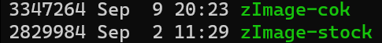

# Some custom Turris Packages
Just a small collection of packages for Turris OS (OpenWRT) that I build in my free time. Don't expect anything. Not even that it builds... 

**Featuring**:
* [Docker CE](#docker-ce-containerd)
* [containerd](#docker-ce-containerd)

## TLDR: I just want docker on Turris Omnia without risk of breaking other stuff
1. Install repo: `curl https://raw.githubusercontent.com/selwtf/turris/master/toolchain/install/repo.sh | sh -`
   
   ⚠️**ATTENTION**⚠️: This will install selwtf (my) repository public keys in your Turris Device!
2. Install 'docker' package: `curl https://raw.githubusercontent.com/selwtf/turris/master/toolchain/install/package.sh | sh -s docker`
3. (Optional) Trigger `pkgupdate`

## TLDR: I want docker on Turris Omnia with more cgroups, stability,...
**This will replace the stock kernel with a custom build with bigger filesize:**

*(You can find the custom kernel config in ./toolchain/turris-cok-sdk/kcfg_docker)*
1. Install container-optimized kernel repo: `curl https://raw.githubusercontent.com/selwtf/turris/master/toolchain/install/repo-cok.sh | sh -`
2. Install 'docker' package: `curl https://raw.githubusercontent.com/selwtf/turris/master/toolchain/install/package.sh | sh -s docker`
3. (Optional) Trigger `pkgupdate`

## A bit less TLDR: What do the install scripts do?
1. Install my current two usign public keys on your router: release and standby. If the release key ever gets compromised, I can revoke it immediately, promote the standby key to the new current release key and deliver a new standby key in a future update signed with the new release key. 
2. Add a file (`/etc/updater/conf.d/selwtf-repo`) to Turris Updater representing a package repository (vanilla or cok - can't have both)
3. Each install script adds a file (`/etc/updater/conf.d/selwtf-package-<name>`) to Turris Updater representing a specific package

## Packages
### Docker CE (+ containerd)
*With thanks to the [OpenWRT Community](https://github.com/openwrt/packages/tree/master/utils/docker-ce)*

*Turris Omnia Vanilla Build:* 

*Turris Omnia COK Build:* 

## Container-optimized Kernel (cok)

**TODO**

## CI
CI builds are run using Github Actions (see `.github/workflows`)

## Turris Toolchain
Toolchain (build, deploy, etc.) images for developing software on [Turris devices](https://www.turris.cz/en/):

**turris-sdk**: Toolchain to build specific package for vanilla (stock) Turris OS

Build Status: 

Image: [selwtf/turris-sdk](https://hub.docker.com/u/selwtf/turris-sdk)

Tags:
   * **omnia-latest** *rolling tag* representing the most recent Turris Omnia **TESTING** release from the *hbk* branch in [turris-build](https://gitlab.nic.cz/turris/turris-build)
   * **omnia-stable** *rolling tag* representing the last stable Turris Omnia release from the most recent tag in [turris-build](https://gitlab.nic.cz/turris/turris-build)
   * **omnia-vX.X.X** *stable tags* e.g. v.5.1.0 remembering the history of Turris Omnia SDK for up to 6 months

**turris-cok-sdk**: Toolchain to build specific package for Turris OS with *container-optimized kernel* (cok) \[**WIP!**\]

Build Status: 

Image: [selwtf/turris-cok-sdk](https://hub.docker.com/u/selwtf/turris-cok-sdk)

Tags:
   * **omnia-latest** *rolling tag* representing the most recent Turris Omnia **TESTING** release from the *hbk* branch in [turris-build](https://gitlab.nic.cz/turris/turris-build)
   * **omnia-stable** *rolling tag* representing the last stable Turris Omnia release from the most recent tag in [turris-build](https://gitlab.nic.cz/turris/turris-build)
   * **omnia-vX.X.X** *stable tags* e.g. v.5.1.0 remembering the history of Turris Omnia SDK for up to 6 months
